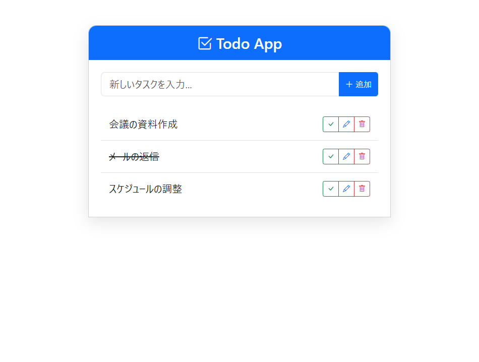
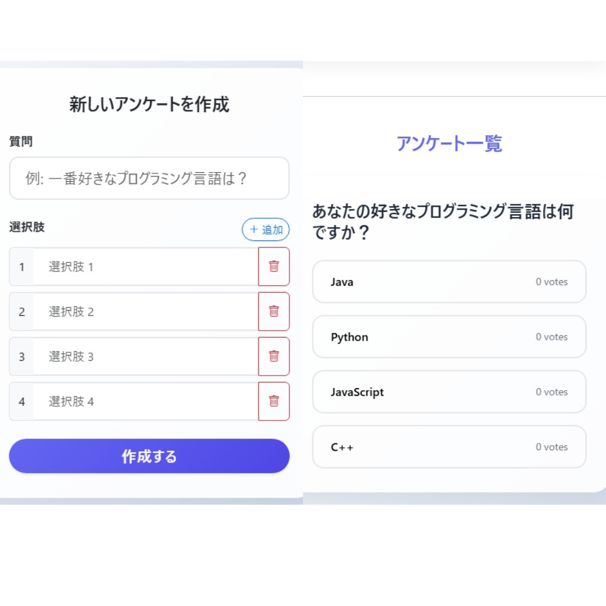

# SpringBootProjects

本リポジトリは、Spring Boot を中心とした学習用プロジェクトのコレクションです。
マイクロサービスやフルスタック開発の構成を学習するために、複数のアプリケーションを管理しています。

---

## 🚀 プロジェクト一覧

### 1. Todoアプリ ([Todo-App](./Todo-App))

シンプルなタスク管理アプリケーションです。

- **主な機能**: タスクの登録、一覧表示、完了、削除。
- **技術スタック**:
  - **Backend**: Spring Boot 3.5, Spring Data JPA
  - **Frontend**: Thymeleaf, Bootstrap 5
  - **Database**: MySQL
- **イメージ**:
  

---

### 2. Chatアプリ ([Chat-App](./Chat-App))

WebSocket を使用したリアルタイムチャットアプリケーションです。

- **主な機能**: ユーザー間のリアルタイムメッセージ送受信。
- **技術スタック**:
  - **Backend**: Spring Boot 3.5, Spring WebSocket (STOMP)
  - **Frontend**: Thymeleaf, Bootstrap 5, SockJS
- **イメージ**:
  

---

### 3. アンケートアプリ ([Voting-App](./Voting-App))

Angular と Spring Boot を組み合わせたフルスタックな投票システムです。

- **主な機能**: 新しいアンケートの作成（動的な選択肢追加）、リアルタイムな投票、結果のプログレスバー表示。
- **技術スタック**:
  - **Backend**: Spring Boot 3.5 (REST API), Spring Data JPA
  - **Frontend**: Angular 21, Bootstrap 5, Bootstrap Icons
  - **Database**: MySQL
- **イメージ**:
  

---

## 🛠 共通のセットアップ

各プロジェクトのディレクトリに移動し、以下の手順で実行可能です。

### Backend (Spring Boot)
```bash
./mvnw spring-boot:run
```

### Frontend (Voting-App のみ)
```bash
cd poll-app
npm install
npm start
```
